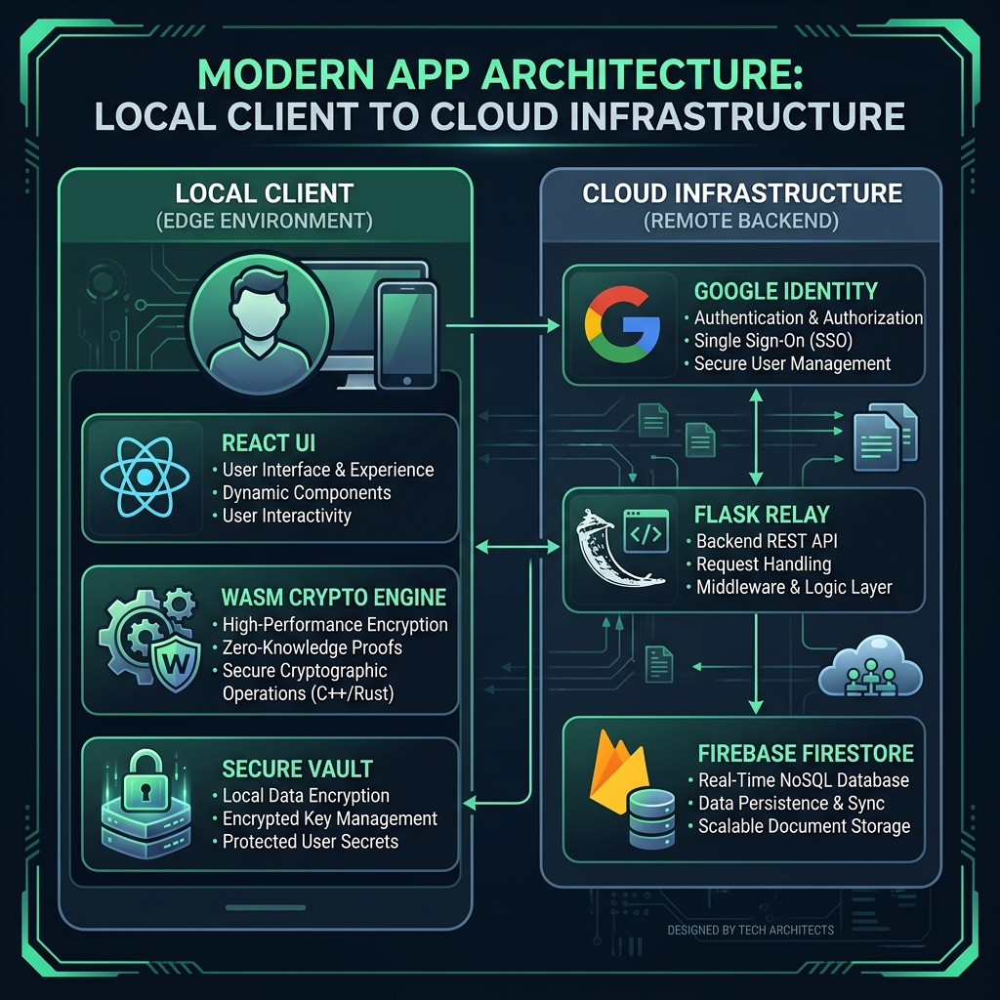
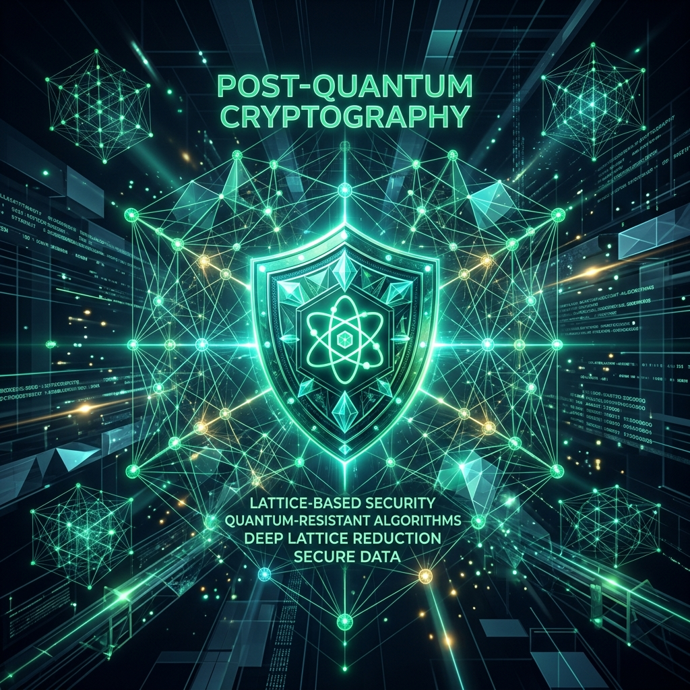

# AGIES: Quantum-Resistant Secure Messaging Protocol


> **AGIES** (Advanced General Identity Encryption System) is a post-quantum secure messaging platform designed for the next era of cryptographic threats. It implements a unique hybrid security stack combining physical-layer security principles with advanced mathematical algorithms.

---

## 🏗️ System Architecture

AGIES follows a **Client-Side Heavy, Server-Relay** architecture. All cryptographic operations occur exclusively in the user's browser, ensuring the backend never touches plaintext data or private keys.



### Core Components:
-   **Local Client**: React-based UI integrated with a high-performance **WASM-accelerated Crypto Engine** and **IndexedDB Vault** for secure key storage.
-   **Secure Relay**: A specialized **Flask-SocketIO** backend that coordinates real-time message delivery without decryption capability.
-   **Persistence Layer**: **Firebase Firestore** handles metadata and encrypted message queuing for offline delivery.
-   **Identity Provider**: **Google Auth** with verified identity mapping for secure peer verification.

---

## 🔒 The Hybrid PQC Stack

Traditional RSA and ECC are vulnerable to future quantum computers (Shor's Algorithm). AGIES mitigates this with a multi-layered defense based on NIST-standard Post-Quantum algorithms.



### 1. Key Establishment (KEM)
We utilize **CRYSTALS-Kyber**, a lattice-based key encapsulation mechanism, to establish high-entropy shared secrets between users. Lattice-based cryptography is mathematically grounded in the "shortest vector problem" in high-dimensional grids, which remains intractable for quantum solvers.

### 2. Digital Signatures
**CRYSTALS-Dilithium** ensures message authenticity and non-repudiation. Every packet is signed by the sender's quantum-safe head and verified by the receiver, making identity spoofing mathematically impossible.

### 3. Messaging Handshake Flow


---

## 🎯 Core Philosophy

### Zero-Knowledge Architecture
AGIES is built on the principle that the platform provider should be an "ignorant observer." User identities are linked via cryptographic handles, and raw messages are encrypted before they ever leave the local machine.

### Privacy-First Identity
By integrating **Firebase Google Auth** with verified identity mapping, AGIES ensures that while users remain anonymous to the platform, they can securely verify their peers' identities via cryptographically signed profiles.

### Ephemeral Persistence
Data in AGIES can be configured for ephemeral storage. Cryptographic keys and session data are stored in a secure local vault (IndexedDB) and can be purged instantly, leaving no digital footprint.

---

## 🚀 Key Features

- **End-to-End Encryption (E2EE)**: Zero-knowledge architecture.
- **Quantum-Safe**: Future-proof against quantum decryption using NIST-standard algorithms.
- **Identity Linking**: Secure Google Sign-In with email-verified identity tracking.
- **Real-Time Synthesis**: Sub-100ms message delivery via optimized WebSockets.
- **Brutalist UI**: A sharp, high-contrast interface designed for focus and speed.

---

## 🛠️ Technical Implementation

### Frontend (React + Vite + TypeScript)
- **State Management**: React Context + Hooks.
- **Styling**: Tailwind CSS v4 with Dark Mode support.
- **Networking**: Socket.io Client for real-time duplex communication.
- **Crypto Engine**: Custom WASM-accelerated Post-Quantum library wrapper.

### Backend (Python + Flask)
- **Relay Logic**: Event-driven architecture using Flask-SocketIO.
- **Database**: Firebase Firestore for metadata and encrypted message queuing.
- **Authentication**: Firebase Admin SDK for secure token verification.

---

## ⚙️ Setup Instructions

### 1. Requirements
- Node.js 18+
- Python 3.11+
- Firebase Project with Firestore enabled.

### 2. Environment Variables

**Frontend (`/frontend/.env`)**:
```env
VITE_API_URL=http://localhost:5000
VITE_FIREBASE_API_KEY=your_key
VITE_FIREBASE_AUTH_DOMAIN=your_project.firebaseapp.com
VITE_FIREBASE_PROJECT_ID=your_project
```

**Backend (`/backend/.env`)**:
```env
FIREBASE_CREDENTIALS={"type": "service_account", ...}
FLASK_ENV=development
```

---

## 📝 License
Distributed under the **MIT License**. See `LICENSE` for more information.

---
**Disclaimer**: This project is for educational purposes as part of a Senior Capstone Project. While it uses NIST-standard PQC algorithms, it has not been audited for production usage.
